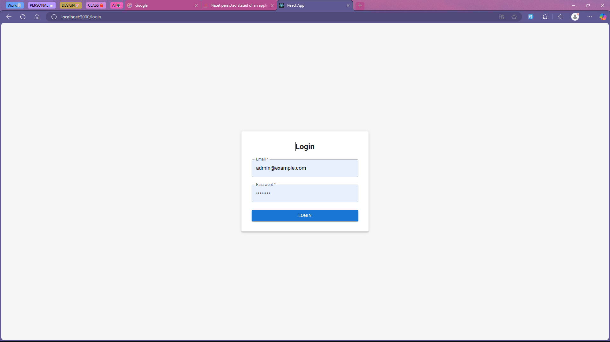
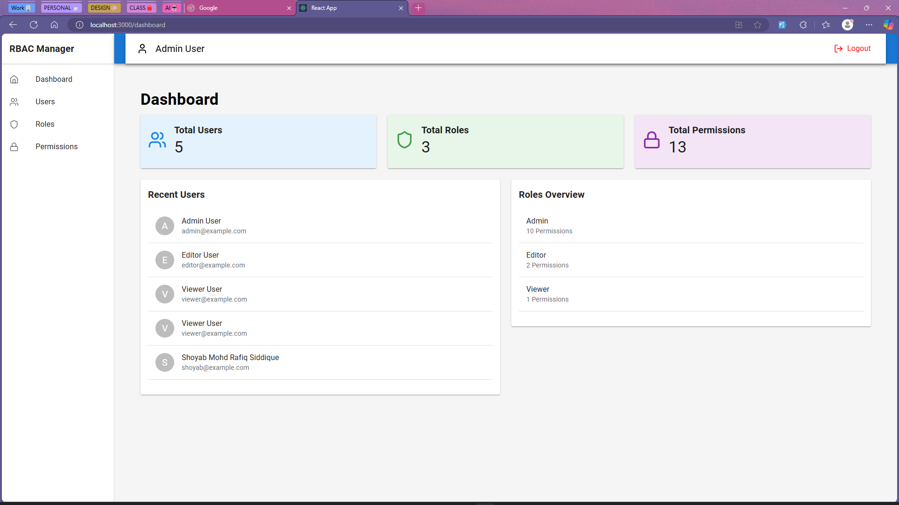
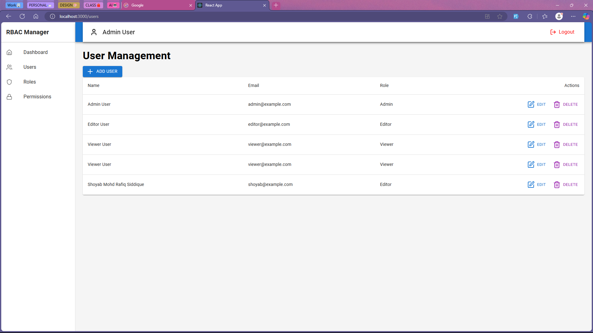
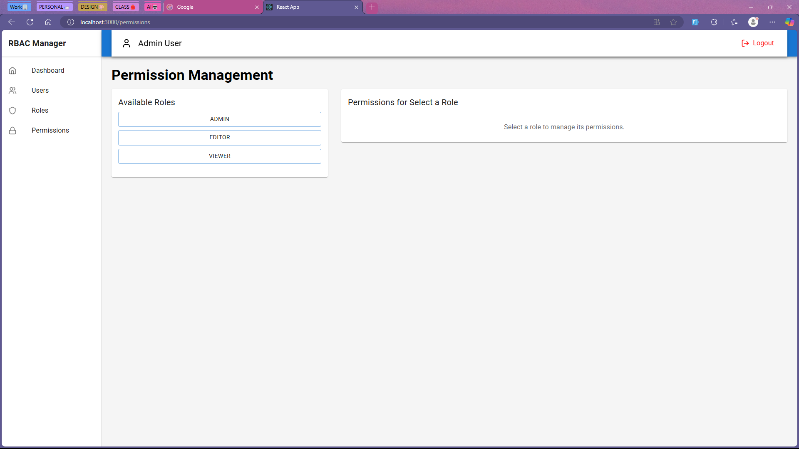

# RBAC UI

This project demonstrates a React application implementing Role-Based Access Control (RBAC). It provides a user interface for managing users, roles, and permissions.

## Demo

- https://exquisite-capybara-e094a7.netlify.app/login
- email: admin@example.com
- password: admin123

## Features

- User Management: Create, read, update, and delete users.
- Role Management: Create, read, update, and delete roles. Assign permissions to roles.
- Permission Management: Assign permissions to roles, controlling access to specific application features.
- Protected Routes: Secure application routes based on user roles and permissions.
- Authentication: (Mock) User authentication with email and password.
- Unauthorized Page: Redirect users to an unauthorized page if they attempt to access restricted resources.
- Modern UI: Built using React, Tailwind CSS, and Lucide React icons for a clean and responsive interface.
- State Management: Uses Zustand for efficient state management.
- Routing: Uses React Router for navigation.

## Getting Started

These instructions will get you a copy of the project up and running on your local machine for development and testing purposes.

### Prerequisites

- Node.js and npm (or yarn) installed.

### Installation

1. Clone the repository:
   ```
   git clone https://github.com/your-username/rbac-ui.git  // Replace with your actual repo URL
   ```
2. Navigate to the project directory:
   ```
   cd rbac-ui
   ```
3. Install dependencies:
   ```
   npm install -g bun
   bun install
   ```

### Running the Application

```
bun start
```

The application will run on `http://localhost:3000` by default.

## Mock Data

The application currently uses mock data for users, roles, and permissions. This is for demonstration purposes and will be replaced with a backend API integration in the future. The mock data is located in the respective Zustand stores (`src/store`).

## Outputs

### Login Screen



### Dashboard Screen



### User Management Screen



### General Settings Screen



## Future Enhancements

- Integrate with a backend API for persistent data storage.
- Implement more robust error handling and input validation.
- Enhance the UI/UX, especially for user, role, and permission details.
- Add more comprehensive testing.
